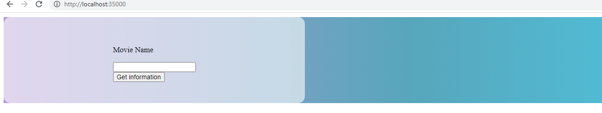
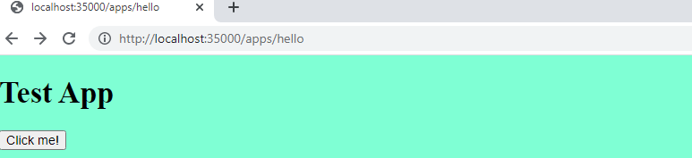
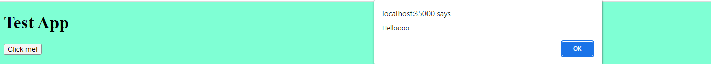
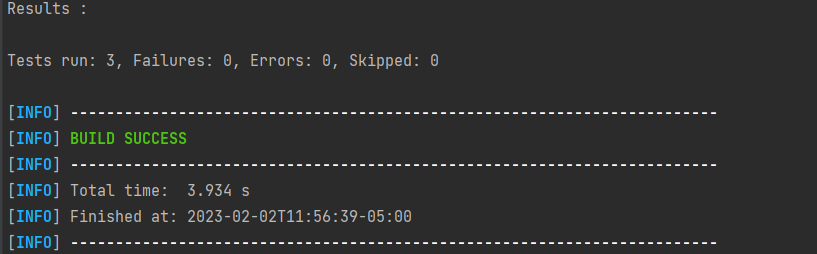

# Taller 3

Se construye un servidor web para soportar una funcionalidad similar a la de Spark. 
La aplicación permite el registro de servicios get y post usando funciones lambda. 
Permite configurar el directorio de los archivos estáticos, y 
cambiar el tipo de la respuesta a "application/json".

### Instalando
Descarga o clona el repositorio y ejecuta
```
mvn package
```

luego puedes ejecutar desde tu IDE o en la terminal

```
java -cp .\target\classes\ edu.eci.arsw.webapps.FirstApp
```
Posteriormente ingresando a localhost:35000 se puede ver:



Luego, puedes ingresar a http://localhost:35000/apps/hello donde podrás encontrar



Dando click sobre el botón se ve que sale una venta lo que junto con el color del background nos permite evidenciar el
correcto funcionamiento de los servicios para retornar HTML, CSS y JS del servidor.



Ahora, 

## Corriendo tests

Para correr las pruebas puedes des tu IDE o usando el comando

```
mvn test
```




Para las pruebas se hizo uso del nombramiento given_When_Then

```
givenAvalueWhenSaveInCacheThenReturnIt()
```

## Diseño


## Built With

* [Maven](https://maven.apache.org/) - Dependency Management


## Versioning

*  Se hizo uso de git para el manejo de versionamiento.

## Authors

* **Wilson Alirio Delgado Hernández** 

