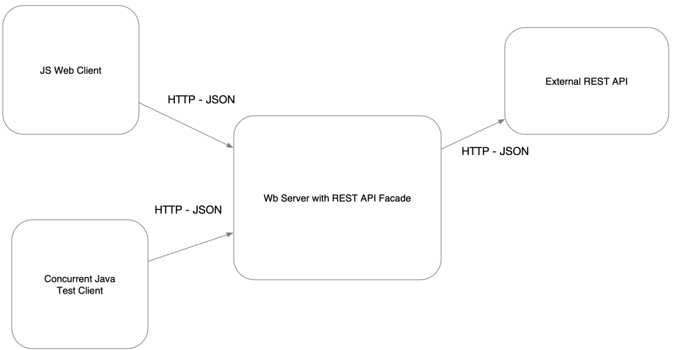
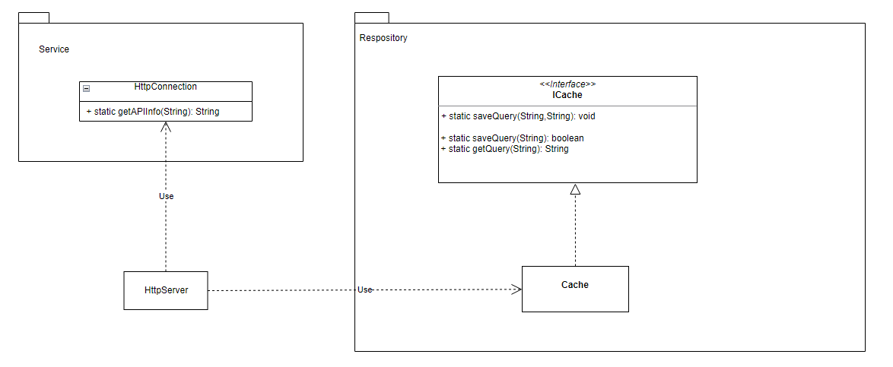
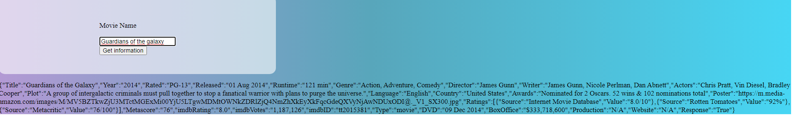
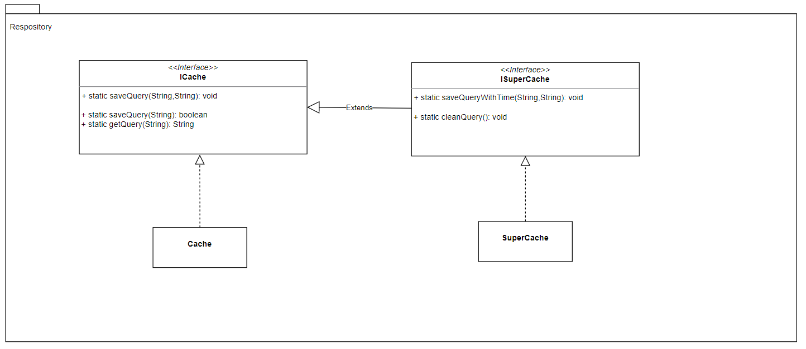

# Taller 3

Se construye un servidor web para soportar una funcionalidad similar a la de Spark. 
La aplicación permite el registro de servicios get y post usando funciones lambda. 
Permite configurar el directorio de los archivos estáticos, y 
cambiar el tipo de la respuesta a "application/json".

### Instalando
Descarga o clona el repositorio y ejecuta
```
mvn package
```

luego puedes ejecutar desde tu IDE o en la terminal

```
java -cp .\target\classes\ edu.eci.arsw.webapps.FirstApp
```
Posteriormente ingresando a localhost:35000 se puede ver:


Luego, puedes ingresar a http://localhost:35000/apps/hello donde podrás encontrar


Dando click sobre el botón se ve que sale una venta lo que junto con el color del background nos permite evidenciar el
correcto funcionamiento de los servicios para retornar HTML, CSS y JS del servidor.


## Corriendo tests

Para correr las pruebas puedes des tu IDE o usando el comando

```
mvn test
```


Para las pruebas se hizo uso del nombramiento given_When_Then

```
givenAvalueWhenSaveInCacheThenReturnIt()
```

## Diseño

Teniendo en cuenta la arquitectura propuesta: 



El diseño implementado en la aplicación es:



Donde se tiene también la clase ClientJavaTesting para realizar los llamados al servidor HttpServer.

Para ejemplificar la búsqueda del nombre de una película se tiene:




### Ejemplo extensibilidad
Se puede extender las funcionalidades del caché para así poder aumentar el rendimiento de la aplicación. Por ejemplo si se quiere adicionar una funcionalidad de limpiar el caché o de guardar en el caché el título, con respuesta y hora para luego poder actualizar con nueva información si la información ya es obsoleta.





### Ejemplo para que una función que sea implementada por otro proveedor
Por ejemplo el método getAPIInfo de HttpConnection, podría ser accedido teniendo un punto de acceso en HttpServer, exponiéndolo así como un servicio para los clientes que hagan peticiones a este. 


## Built With

* [Maven](https://maven.apache.org/) - Dependency Management


## Versioning

*  Se hizo uso de git para el manejo de versionamiento.

## Authors

* **Wilson Alirio Delgado Hernández** 

